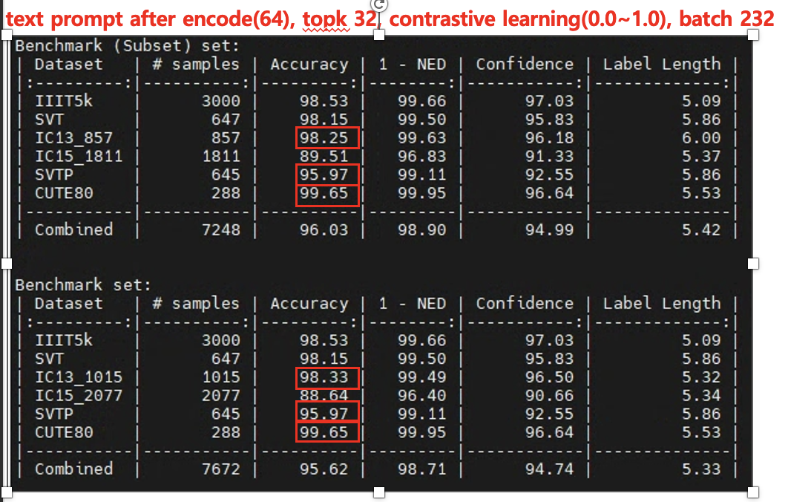

Scene Text Recognition with CLIP-Enhanced PARSeq with contrastive learning for Scene Text Recognition

  

  

Getting Started

Most code is under Apache-2.0 (see LICENSE). Reproduced ABINet and CRNN sources follow their BSD/MIT licenses (see their LICENSE files). See NOTICE for copyright.

Installation

Requires Python ≥ 3.8 and PyTorch ≥ 1.10 (≤ 1.13).

# Choose your PyTorch build: cpu | cu116 | cu117 | rocm5.2
platform=cpu
make torch-${platform}

# Install core + train + test dependencies
pip install -r requirements/core.${platform}.txt -e .[train,test]

# (Optional) For CLIP encoder support
pip install git+https://github.com/openai/CLIP.git

Datasets

See Datasets.md
.

LMDB archives for MJSynth, SynthText, IIIT5k, SVT, SVTP, IC13, IC15, CUTE80, ArT, RCTW17, ReCTS, LSVT, MLT19, COCO-Text, Uber-Text.

LMDB archives for TextOCR and OpenVINO.

Pretrained via Torch Hub (baseline PARSeq)
import torch
from PIL import Image
from strhub.data.module import SceneTextDataModule

parseq = torch.hub.load('baudm/parseq', 'parseq', pretrained=True).eval()
img_transform = SceneTextDataModule.get_transform(parseq.hparams.img_size)

img = Image.open('/path/to/image.png').convert('RGB')
img = img_transform(img).unsqueeze(0)  # (B, C, H, W)

logits = parseq(img)                   # [B, 26, 95] (94 chars + [EOS])
pred = logits.softmax(-1)
label, confidence = parseq.tokenizer.decode(pred)
print('Decoded label =', label[0])

CLIP-Enhanced PARSeq (optional)

This repo adds an optional mode that swaps PARSeq’s visual backbone with a CLIP ViT encoder (e.g., ViT-B/32) while keeping the PARSeq decoder, tokenizer, and permuted AR training intact. This leverages CLIP’s robust image features for STR.

Highlights

Encoder: CLIP ViT (default: vit_b32).

Preprocess: CLIP mean/std and resizing; keep PARSeq text pipeline unchanged.

Training: Start with the CLIP encoder frozen, then unfreeze, or fine-tune end-to-end.

Train (pick one that matches your config names)

# Preconfigured experiment
./train.py +experiment=parseq-clip-b32 trainer.accelerator=gpu trainer.precision=16

# Explicit overrides (example arg names; adapt to your code)
./train.py model.encoder=clip_vit_b32 data.normalize=clip model.img_size=[224,224] \
           trainer.accelerator=gpu trainer.precision=16

Inference / Evaluation

# Read images with a CLIP-PARSeq checkpoint
./read.py /path/to/clip_parseq.ckpt --images demo_images/* \
          refine_iters:int=2 decode_ar:bool=false

# Evaluate on benchmarks (mixed-case + punctuation)
./test.py /path/to/clip_parseq.ckpt --cased --punctuation --batch_size 512 --num_workers 16

Training

You can override any configuration via CLI (Hydra). See ./train.py --help.

# Finetune using pretrained weights (baseline)
./train.py pretrained=parseq-tiny          # Not all experiments have pretrained weights

# Train a variant / preconfigured experiment
./train.py +experiment=parseq-tiny         # e.g., abinet-sv, trbc

# Character set
./train.py charset=94_full                 # or 36_lowercase / 62_mixed-case

# Dataset
./train.py dataset=real                    # or synth

# Data settings
./train.py data.root_dir=data data.num_workers=2 data.augment=true

# General model knobs
./train.py model.img_size=[32,128] model.max_label_length=25 model.batch_size=384

# Lightning Trainer
./train.py trainer.max_epochs=20 trainer.accelerator=gpu trainer.devices=2
# (Use +param=... for fields not in configs/main.yaml)

Evaluation

test.py evaluates any trained checkpoint. Runtime params use param:type=value.

# Baseline (36-char set)
./test.py outputs/<model>/<ts>/checkpoints/last.ckpt

# Mixed-case (62) or 94-char set
./test.py outputs/<model>/<ts>/checkpoints/last.ckpt --cased
./test.py outputs/<model>/<ts>/checkpoints/last.ckpt --cased --punctuation

# NAR decoding + 2 refinement iterations
./test.py outputs/<model>/<ts>/checkpoints/last.ckpt refine_iters:int=2 decode_ar:bool=false

Example output

| Dataset   | # samples | Accuracy | 1 - NED | Confidence | Label Length |
| IIIT5k    |      3000 |    99.00 |   99.79 |      97.09 |         5.09 |
| SVT       |       647 |    97.84 |   99.54 |      95.87 |         5.86 |
| ...       |        ...|      ... |     ... |        ... |          ... |
| Combined  |      7672 |    95.95 |   98.78 |      95.34 |         5.33 |

Benchmarks & Utilities

# Compute requirements (Figure 5)
./bench.py model=parseq model.decode_ar=false model.refine_iters=3

# Latency vs label length (Appendix I)
./bench.py model=parseq model.decode_ar=false model.refine_iters=3 +range=true

# Orientation robustness (Appendix J)
./test.py <ckpt> --cased --punctuation              # 0°
./test.py <ckpt> --cased --punctuation --rotation 90
./test.py <ckpt> --cased --punctuation --rotation 180
./test.py <ckpt> --cased --punctuation --rotation 270

# Read images (Appendix L)
./read.py <ckpt_or_pretrained> --images demo_images/*
# e.g., NAR + 2 iters
./read.py pretrained=parseq refine_iters:int=2 decode_ar:bool=false --images demo_images/*

Tuning

We use Ray Tune
 for LR search. See ./tune.py --help.

./tune.py tune.num_samples=20
./tune.py +experiment=tune_abinet-lm

Citation
@InProceedings{bautista2022parseq,
  title={Scene Text Recognition with Permuted Autoregressive Sequence Models},
  author={Bautista, Darwin and Atienza, Rowel},
  booktitle={European Conference on Computer Vision},
  pages={178--196},
  month={10},
  year={2022},
  publisher={Springer Nature Switzerland},
  address={Cham},
  doi={10.1007/978-3-031-19815-1_11},
  url={https://doi.org/10.1007/978-3-031-19815-1_11}
}
